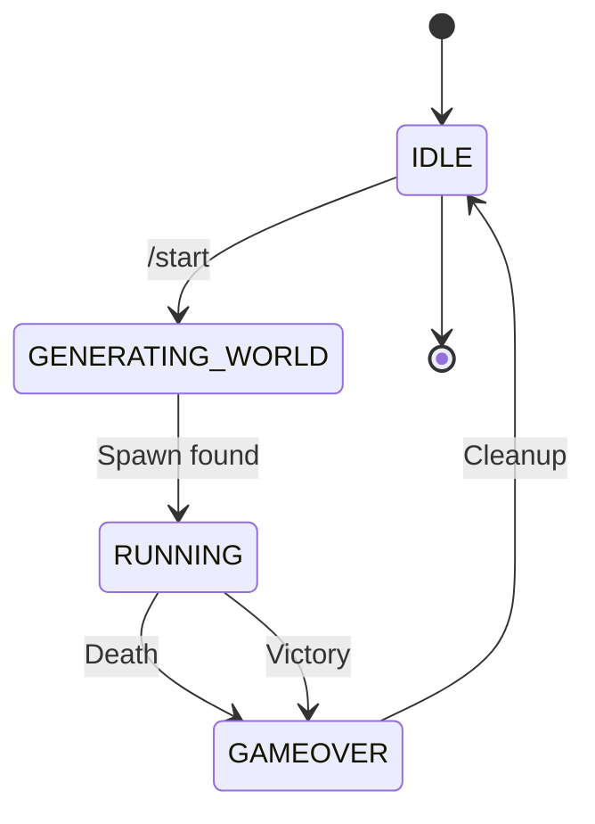

In Soul Link mode, all players share a single life pool. When any player's death would reduce shared health to zero, the entire run ends for everyone.

## Death detection

Death is detected through the shared health system. When health reaches zero, `RunManager.triggerGameOver()` is called:

```java SharedStatsHandler.java:173
if (sharedHealth <= 0) {
    SoulLink.LOGGER.info("Shared health depleted - triggering game over");
    runManager.triggerGameOver();
    return;
}
```

This happens in two scenarios:

### Direct damage

When a player takes damage that reduces shared health to zero:

```java SharedStatsHandler.java:139
public static void onPlayerHealthChanged(ServerPlayerEntity damagedPlayer, float newHealth,
        DamageSource damageSource) {
    // ...
    sharedHealth = MathHelper.clamp(newHealth, 0.0f, getMaxHealth());
    
    if (sharedHealth <= 0) {
        SoulLink.LOGGER.info("Shared health depleted - triggering game over");
        runManager.triggerGameOver();
        return;
    }
}
```

### Periodic damage accumulation

When poison/wither damage accumulator reduces health to zero:

```java SharedStatsHandler.java:299
if (sharedHealth <= 0) {
    runManager.triggerGameOver();
}
```

## Game over sequence

When triggered, the game over sequence executes:

### 1. State transition

```java RunManager.java:445
public synchronized void triggerGameOver() {
    if (gameState != RunState.RUNNING) {
        return;
    }
    
    SoulLink.LOGGER.info("Game Over triggered!");
    
    timerService.stop();
    gameState = RunState.GAMEOVER;
}
```

The synchronized method prevents race conditions from multiple simultaneous deaths.

### 2. Cleanup teams

In Manhunt mode, teams are removed:

```java RunManager.java:455
ManhuntManager.getInstance().cleanupTeams(server);
CompassTrackingHandler.reset();
```

### 3. Visual effects

Each player receives visual and audio feedback:

```java RunManager.java:460
for (ServerPlayerEntity player : server.getPlayerManager().getPlayerList()) {
    if (isInRun(player)) {
        player.changeGameMode(GameMode.SPECTATOR);
        player.getInventory().clear();
        
        ServerWorld world = getPlayerWorld(player);
        if (world != null) {
            world.playSound(null, player.getX(), player.getY(), player.getZ(),
                    SoundEvents.ENTITY_WITHER_DEATH, SoundCategory.PLAYERS, 0.5f, 0.8f);
        }
        
        player.networkHandler.sendPacket(
            new TitleS2CPacket(
                Text.literal("GAME OVER")
                    .formatted(Formatting.RED, Formatting.BOLD)));
        
        player.networkHandler.sendPacket(
            new SubtitleS2CPacket(
                Text.literal(finalTime).formatted(Formatting.WHITE)));
    }
}
```

**Effects applied:**
- Changed to spectator mode
- Inventory cleared
- Wither death sound played
- "GAME OVER" title displayed in red
- Final time shown as subtitle

### 4. Chat notification

A clickable restart message is broadcast:

```java RunManager.java:479
Text restartMessage = Text.empty()
    .append(getPrefix())
    .append(Text.literal("All players are dead. Click ").formatted(Formatting.GRAY))
    .append(Text.literal("here")
        .setStyle(Style.EMPTY
            .withColor(Formatting.BLUE)
            .withUnderline(true)
            .withClickEvent(new ClickEvent.RunCommand("/start"))
            .withHoverEvent(new HoverEvent.ShowText(
                Text.literal("Start a new attempt").formatted(Formatting.GRAY)))))
    .append(Text.literal(" or use ").formatted(Formatting.GRAY))
    .append(Text.literal("/start").formatted(Formatting.GOLD))
    .append(Text.literal(" to start a new attempt.").formatted(Formatting.GRAY));

server.getPlayerManager().broadcast(restartMessage, false);
```

<Info>
**[SoulLink]** All players are dead. Click **here** or use `/start` to start a new attempt.
</Info>

## Manhunt mode differences

In Manhunt mode, the death system works differently:

### Runner death

When a Runner dies, only Runners share the death:

```java SharedStatsHandler.java:60
private static boolean shouldParticipateInSoulLink(ServerPlayerEntity player) {
    RunManager runManager = RunManager.getInstance();
    if (!runManager.isRunActive()) return false;
    
    if (!Settings.getInstance().isManhuntMode()) return true;
    
    return ManhuntManager.getInstance().isSpeedrunner(player);
}
```

Hunters continue playing with vanilla health mechanics.

### Hunter death

Hunters respawn at spawn with full health:

```java
// Hunter respawn logic in ServerPlayerEntityMixin
if (ManhuntManager.getInstance().isHunter(player)) {
    BlockPos spawnPos = RunManager.getInstance().getSpawnPos();
    player.teleport(overworld, spawnPos.getX(), spawnPos.getY(), spawnPos.getZ(),
        Set.of(), 0, 0, true);
}
```

Hunters have unlimited lives. Only Runner death ends the run.

## Victory condition

The run also ends (successfully) when the Ender Dragon is defeated:

```java RunManager.java:495
public synchronized void triggerVictory() {
    if (gameState != RunState.RUNNING) {
        return;
    }
    
    SoulLink.LOGGER.info("Victory! Dragon defeated!");
    
    timerService.stop();
    gameState = RunState.GAMEOVER;
}
```

Victory uses similar cleanup but different visual effects:

```java RunManager.java:510
for (ServerPlayerEntity player : server.getPlayerManager().getPlayerList()) {
    world.playSound(null, player.getX(), player.getY(), player.getZ(),
            SoundEvents.UI_TOAST_CHALLENGE_COMPLETE, SoundCategory.PLAYERS, 1.0f, 1.0f);
    
    player.networkHandler.sendPacket(
        new TitleS2CPacket(
            Text.literal("VICTORY")
                .formatted(Formatting.GOLD, Formatting.BOLD)));
    
    player.networkHandler.sendPacket(
        new SubtitleS2CPacket(
            Text.literal(finalTime).formatted(Formatting.WHITE)));
}
```

## State diagram



The `GAMEOVER` state persists until `/start` is used to begin a new run.

## Thread safety

Both `triggerGameOver()` and `triggerVictory()` are synchronized:

```java RunManager.java:445
public synchronized void triggerGameOver() {
    if (gameState != RunState.RUNNING) {
        return;
    }
    // ...
}
```

This prevents:
- Multiple simultaneous deaths from triggering game over twice
- Death and victory happening at the exact same time
- Race conditions from async damage events

## Why one death ends the run?

The core Soul Link mechanic creates high-stakes cooperation:

<CardGroup cols={2}>
<Card title="Team coordination" icon="users">
Players must work together and watch each other's backs. No lone-wolfing.
</Card>

<Card title="Risk management" icon="shield">
Dangerous situations affect everyone. The team must decide together when to take risks.
</Card>

<Card title="Shared responsibility" icon="handshake">
Every player's mistakes impact the entire team. Everyone must play carefully.
</Card>

<Card title="Tension" icon="bolt">
The constant threat of instant game over creates dramatic, memorable moments.
</Card>
</CardGroup>

This is what separates Soul Link from traditional co-op: **you truly are linked together**.
