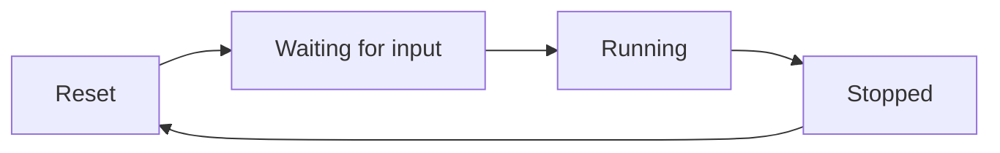

The timer system tracks speedrun completion time using a two-phase approach: waiting for player input, then actively counting elapsed time.

## Timer phases

The timer progresses through these states:



### Phase 1: Waiting for input

After world generation completes, the timer shows `00:00:00 - Move to start`:

```java TimerService.java:43
public void beginWaitingForInput(ServerPlayerEntity player) {
    if (!timerStartedThisRun && !waitingForInput) {
        waitingForInput = true;
        trackedPlayerId = player.getUuid();
        trackedX = player.getX();
        trackedZ = player.getZ();
        trackedYaw = player.getYaw();
        trackedPitch = player.getPitch();
    }
}
```

The system captures one player's position and look direction as a baseline.

### Phase 2: Running

When the player moves or looks around, the timer starts:

```java TimerService.java:99
if (waitingForInput) {
    if (checkForInput(server, isInRunCheck)) {
        waitingForInput = false;
        timerStartedThisRun = true;
        startTimeMillis = System.currentTimeMillis();
        timerRunning = true;
        SoulLink.LOGGER.info("Player input detected! Timer started at 00:00:00");
    }
}
```

## Input detection

The system detects intentional player input by tracking:

### Movement detection

```java TimerService.java:170
double dx = Math.abs(trackedPlayer.getX() - trackedX);
double dz = Math.abs(trackedPlayer.getZ() - trackedZ);
boolean hasMoved = dx > 0.05 || dz > 0.05;
```

Horizontal movement threshold: **0.05 blocks**

### Look direction detection

```java TimerService.java:175
float dYaw = Math.abs(trackedPlayer.getYaw() - trackedYaw);
float dPitch = Math.abs(trackedPlayer.getPitch() - trackedPitch);

// Handle yaw wrapping (e.g., 359° to 1°)
if (dYaw > 180) {
    dYaw = 360 - dYaw;
}

boolean hasLooked = dYaw > 1.0f || dPitch > 1.0f;
```

Look direction threshold: **1 degree**

<Note>
Yaw wrapping is handled to correctly detect small rotations near 0°/360°.
</Note>

### Combined check

```java TimerService.java:187
return hasMoved || hasLooked;
```

The timer starts on **either** movement **or** camera rotation.

## Time calculation

While running, elapsed time is calculated in real-time:

```java TimerService.java:68
public long getElapsedTimeMillis() {
    if (timerRunning) {
        long elapsed = System.currentTimeMillis() - startTimeMillis;
        return Math.max(0, elapsed);
    }
    return elapsedTimeMillis;
}
```

When stopped, the frozen value is returned:

```java TimerService.java:57
public void stop() {
    if (timerRunning) {
        elapsedTimeMillis = System.currentTimeMillis() - startTimeMillis;
        timerRunning = false;
    }
}
```

## Time formatting

Time is displayed as `HH:MM:SS`:

```java TimerService.java:78
public String getFormattedTime() {
    long elapsed = getElapsedTimeMillis();
    long seconds = (elapsed / 1000) % 60;
    long minutes = (elapsed / (1000 * 60)) % 60;
    long hours = (elapsed / (1000 * 60 * 60));
    return String.format("%02d:%02d:%02d", hours, minutes, seconds);
}
```

<CodeGroup>
```java Examples
5000ms   → "00:00:05"
65000ms  → "00:01:05"
3665000ms → "01:01:05"
```
</CodeGroup>

## Action bar display

The timer updates every 0.5 seconds (10 ticks) for performance:

```java TimerService.java:130
if (server.getTicks() % 10 == 0) {
    Text actionBarText = Text.literal(getFormattedTime())
        .formatted(Formatting.WHITE);
    
    for (ServerPlayerEntity player : server.getPlayerManager().getPlayerList()) {
        if (isInRunCheck.test(player) && !skipActionBarFor.test(player)) {
            player.sendMessage(actionBarText, true);
        }
    }
}
```

The `skipActionBarFor` predicate allows other systems (like Manhunt compass tracking) to temporarily hide the timer.

### Waiting message

During the waiting phase, the message alternates:

```java TimerService.java:111
if (server.getTicks() % 10 == 0) {
    Text readyText = Text.empty()
        .append(Text.literal("00:00:00").formatted(Formatting.WHITE))
        .append(Text.literal(" - Move to start").formatted(Formatting.GRAY));
    
    for (ServerPlayerEntity player : players) {
        if (isInRunCheck.test(player) && !skipActionBarFor.test(player)) {
            player.sendMessage(readyText, true);
        }
    }
}
```

## Player tracking

If the tracked player disconnects, a new player is selected:

```java TimerService.java:148
if (trackedPlayer == null || trackedPlayer.isDisconnected()) {
    var players = server.getPlayerManager().getPlayerList()
        .stream()
        .filter(isInRunCheck)
        .toList();
    
    if (players.isEmpty()) {
        return false;
    }
    
    trackedPlayer = players.get(0);
    trackedPlayerId = trackedPlayer.getUuid();
    // Re-capture position
    trackedX = trackedPlayer.getX();
    trackedZ = trackedPlayer.getZ();
    trackedYaw = trackedPlayer.getYaw();
    trackedPitch = trackedPlayer.getPitch();
    return false;
}
```

This ensures the timer can still start even if players join/leave during waiting.

## Integration with run lifecycle

The timer is managed by `RunManager`:

### Start run

```java RunManager.java:193
timerService.reset();
```

### Transition to running

```java RunManager.java:295
teleportService.teleportToSpawn(player, overworld, spawnPos, timerService, syncToShared);
```

Inside `teleportToSpawn`:

```java PlayerTeleportService.java
timerService.beginWaitingForInput(player);
```

### Game over

```java RunManager.java:452
timerService.stop();
String finalTime = timerService.getFormattedTime();
```

### Victory

```java RunManager.java:502
timerService.stop();
String finalTime = timerService.getFormattedTime();
```

## Why two phases?

The two-phase system provides:

<CardGroup cols={2}>
<Card title="Fair timing" icon="stopwatch">
The timer doesn't start until players actually begin playing, not when world generation finishes.
</Card>

<Card title="Preparation time" icon="clock">
Players can orient themselves, check settings, and coordinate before the timer starts.
</Card>

<Card title="Clean runs" icon="circle-check">
Accidental inputs during world loading don't start the timer prematurely.
</Card>

<Card title="Deterministic" icon="chart-line">
Clear visual feedback ("Move to start") tells players exactly when timing begins.
</Card>
</CardGroup>

## Tick method signature

```java TimerService.java:96
public boolean tick(
    MinecraftServer server,
    java.util.function.Predicate<ServerPlayerEntity> isInRunCheck,
    java.util.function.Predicate<ServerPlayerEntity> skipActionBarFor
)
```

**Parameters:**
- `server`: The Minecraft server instance
- `isInRunCheck`: Predicate to check if a player is in the run
- `skipActionBarFor`: Predicate to skip timer display for specific players

**Returns:** `true` if timer is running, `false` otherwise
